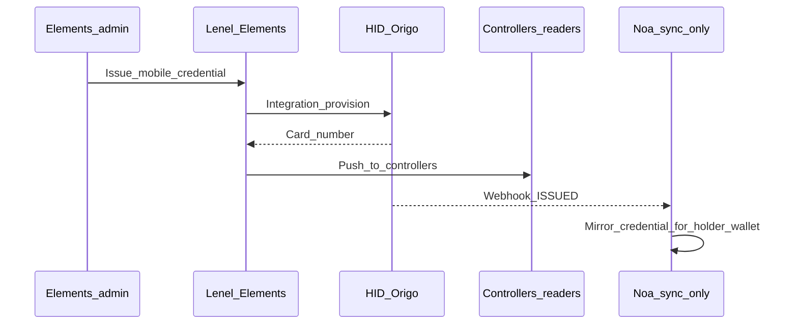
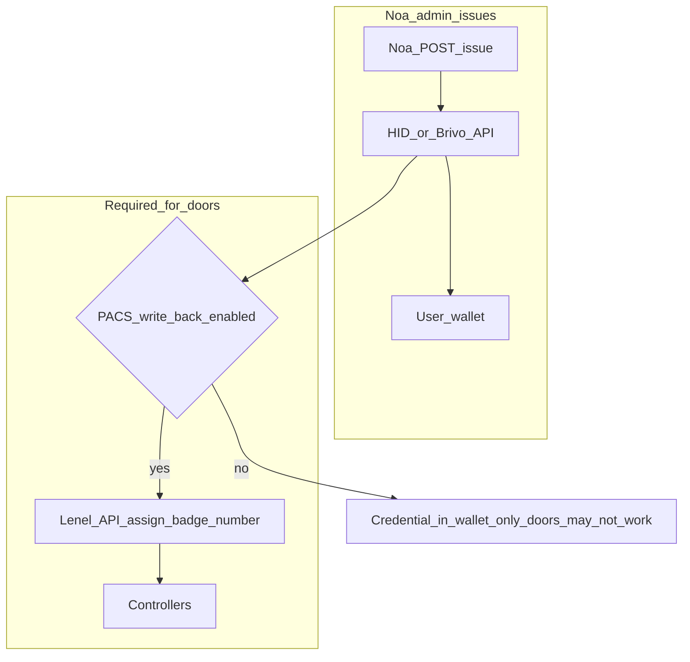
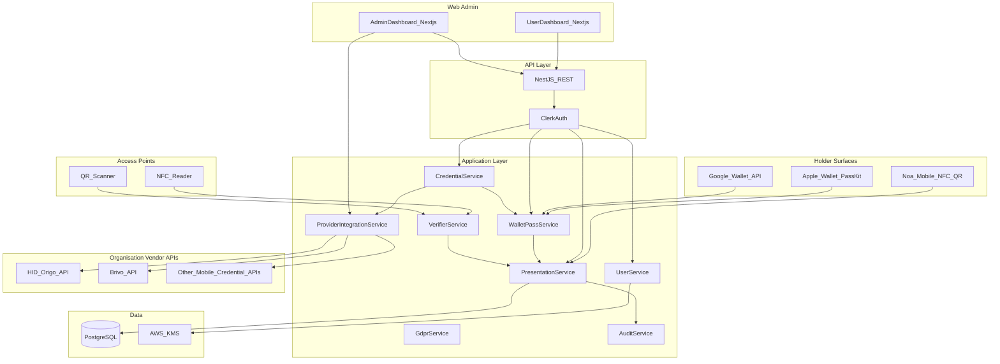
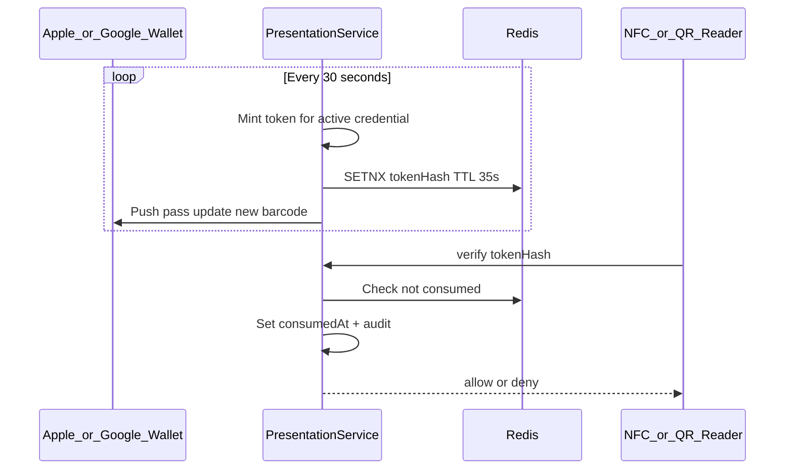
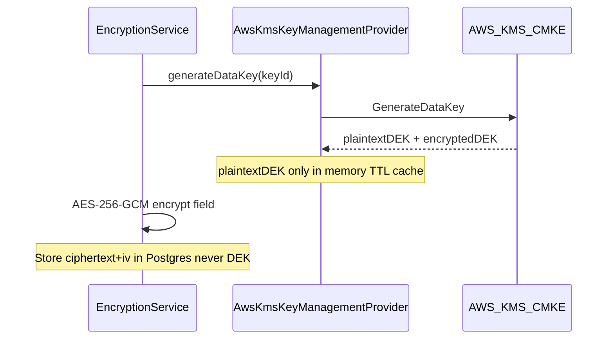
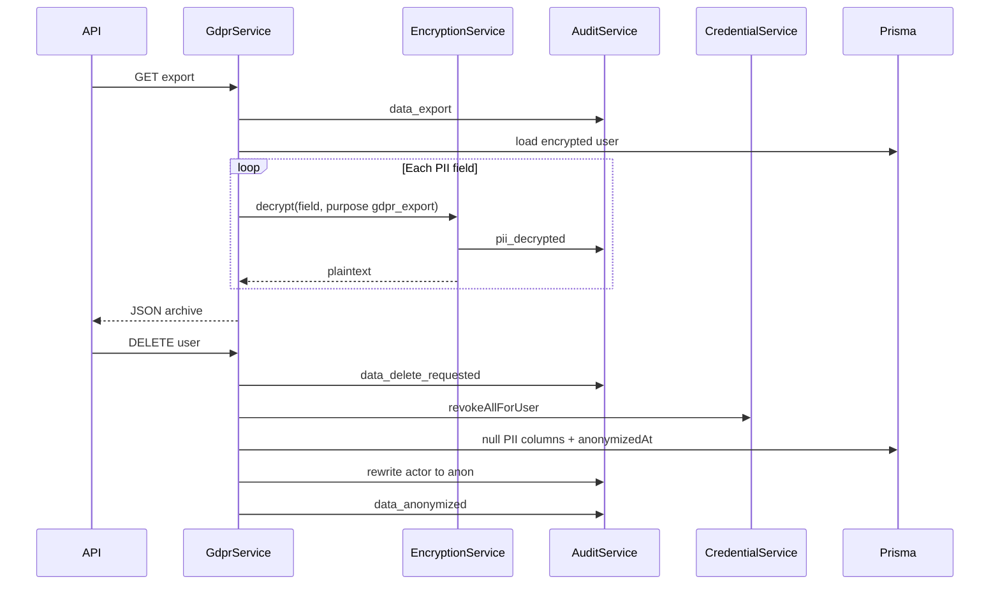

# Noa — Production Platform Plan

## Issuance authority (PACS-led default + optional Noa-led)

**Product decision (v1):** Corporate / building access is **mainly issued from the PACS** (Lenel Elements, OnGuard, etc.). **Noa does not talk to door controllers** in either model — controllers are always driven by the **PACS headend** (or its integration path).

| Question | Answer |
|----------|--------|
| Does Noa talk to controllers? | **No.** Readers/panels are configured by **Lenel/Brivo ACS**, not by Noa. |
| PACS-led issuance | Elements issues → HID creates mobile cred → **card number returns to Elements** → Elements pushes to **controllers**. Noa **syncs + wallet UX** only. |
| Noa-led issuance | Noa calls **HID/Brivo cloud APIs** only. Doors work only if **card number is also written to the PACS** (write-back integration) or credential type has **no PACS** (hotel, gym, event). |

### Per-organization setting

```typescript
// Organization.settings.issuancePolicy
type IssuancePolicy = {
  defaultMode: 'pacs_led' | 'noa_led';           // v1 default: pacs_led
  allowNoaIssuance: boolean;                      // enable Issue button in Noa admin
  allowNoaIssuanceForTypes: CredentialType[];     // e.g. hotel_key, gym_membership, event_pass only
  requirePacsWriteBack: boolean;                  // if true, Noa-led corporate_access must sync card# to Lenel
};
```

| Mode | v1 default | Best for |
|------|------------|----------|
| **pacs_led** | **Yes** | Elements + HID Origo, existing Lenel cardholders |
| **noa_led** | Optional per org | Orgs without PACS, or non-door credentials; pilots |

### PACS-led flow (primary) — Lenel Elements + HID Origo



**Noa v1 for pacs_led:** `POST /credentials/issue` from Noa admin **blocked** or hidden for `corporate_access` when org policy is `pacs_led`. Ingest via HID Events + optional Lenel read API; map `pacsCardholderId`, `cardNumber`, `origoCredentialId`.

### Noa-led flow (optional) — does NOT replace PACS for doors



**Complication of supporting both:** real, but manageable with policy — not with wiring Noa to controllers.

| Risk | Mitigation |
|------|------------|
| **Duplicate mobile credentials** (Elements and Noa both call HID) | Default **block** Noa issue for `corporate_access` when `pacs_led`; dedupe on `cardNumber` / `origoCredentialId` |
| **Revoke mismatch** (revoked in Elements, still active in Noa UI) | Webhooks from HID + audit; Noa status follows vendor/PACS events; admin message “revoke in Elements” |
| **Noa issue without Lenel badge** | `requirePacsWriteBack` + Lenel adapter `assignCardNumber()` or fail issuance with clear error |
| **Two admin UIs** | Noa shows **source: PACS** vs **source: NOA** on each credential; training/docs |

**Noa-led without PACS write-back:** acceptable for **hotel / gym / event** credentials (no Lenel controller). **Not sufficient alone** for Elements+HID **building access** — HID mobile cred must still land in Elements for the card number on the panel.

### Lenel adapter scope (v2)

| Capability | Purpose |
|------------|---------|
| **Read** cardholder / badge (v1.1) | Sync what PACS already issued |
| **Write** card number after Noa-led HID issue (v2) | Optional write-back so doors work |
| **Never** panel/controller programming | Out of scope — remains Lenel’s job |

### Admin UX

| Org policy | Noa “Issue credential” for corporate access |
|------------|-----------------------------------------------|
| `pacs_led` | Disabled or “Issue in Elements” helper text |
| `noa_led` + write-back | Enabled; wizard confirms Lenel cardholder linked |
| `noa_led` without write-back | Allowed only if type ∉ `{ corporate_access }` or explicit override |

### v1 ship scope (LOCKED)

| In v1 | Out of v1 |
|-------|-----------|
| Ingest **corporate_access** from **HID Origo Events** (ISSUED, REVOKED, etc.) | `POST /credentials/issue` for `corporate_access` (API returns **409**) |
| Register org **HID** connection (read + webhooks; not issue path) | Noa → HID **issue** API calls for corporate |
| Map credential: `issuanceSource: PACS`, `externalCredentialId`, `cardNumber`, `pacsCardholderId` | Lenel Elements **read** API (v1.1) |
| Admin UI: “Issue in Elements” + credential **synced from PACS** badge | Noa-led corporate + Lenel write-back |
| Holder: show mirrored corporate cred in My Credentials | Brivo/HID live HTTP issue (stubs OK for connection test) |

**Later (v1.1+):** Lenel read sync; **v2:** optional Noa-led for `hotel_key` / `gym_membership` / `event_pass`; Lenel write-back for Noa-led corporate.

---

## Product definition

**Noa** is a privacy-first identity and credential orchestration platform where **one identity** can belong to **multiple organizations** and hold **multiple credentials** (corporate access, hotel keys, gym, events, visitor passes) with privacy-by-design storage and full lifecycle management.

**Holder experience (primary):** Users carry Noa credentials in **Apple Wallet** and **Google Wallet**, present access via **NFC tap** at readers (doors, turnstiles, hotel locks), with a **rotating QR code** on the pass that **expires every 30 seconds** and is **single-use** (cannot be replayed).

**Core principle:** John Smith can be a member of Law Firm A, Contractor Company B, and Hotel Chain C, each issuing credentials (HID, Brivo, hotel key, gym, event pass) under a single Noa identity — surfaced as wallet passes and NFC-presentable tokens, not only a web dashboard.

**Organisation integrations:** Any organisation that operates mobile credentials can **connect their vendor API to Noa** — e.g. Organisation A registers **HID Origo API** credentials so Noa issues/revokes HID mobile keys on their behalf; Organisation B connects **Brivo**; others plug in LenelS2, hotel PMS, or event platforms the same way. Noa ships **adapter interfaces** per vendor; organisations supply **their** API endpoints and secrets.

**Project location:** [`C:\Users\jeffe\Projects\noa`](C:\Users\jeffe\Projects\noa) — bootstrap via `create_project` + `move_agent_to_root` before implementation.

---

## Architecture overview



**Presentation path:** `PresentationService` mints a **30-second, single-use** token bound to `credentialId` + `userId` + time window → encoded in **wallet pass barcode** and **NFC NDEF/HCE payload** → `VerifierService` validates once and marks consumed.

**Integration path:** Org admin registers **OrganizationProviderConnection** (vendor type + base URL + encrypted API credentials). `CredentialService.issue()` resolves the org’s connection and calls the matching **adapter** (e.g. `HidOrigoAdapter`) — core logic unchanged when new vendors are added.

**Clean architecture rule:** Domain depends on **`ICredentialProvider`** port; `packages/integrations` implements HID Origo, Brivo, etc. **v1:** connection management + adapter stubs that log intended API calls; **v2:** real HTTP to org-configured endpoints.

---

## Tech stack

| Layer | Choice |
|-------|--------|
| Monorepo | **pnpm + Turborepo** |
| API | **NestJS** — modules, DI, guards |
| Mobile | **React Native (Expo prebuild)** — NFC HCE (Android), Core NFC / wallet handoff (iOS), QR fallback |
| Wallet — Apple | **PassKit** (.pkpass), **Wallet Web Service** (register device, push pass updates) |
| Wallet — Google | **Google Wallet API** (Generic / Loyalty pass objects; REST push updates) |
| Presentation | **TOTP-style rotating tokens** — 30s window, **single-use** nonce store (Redis) |
| NFC | **Primary presentation channel** — NDEF/HCE; vendor mobile credential APIs (Origo, Brivo) via org connections |
| Org integrations | **OrganizationProviderConnection** — per-tenant API plug-in; secrets encrypted with same KMS/field encryption pattern |
| Web | **Next.js 15** — User + Admin dashboards (secondary to wallet) |
| Auth | **Clerk** — email/password, Google OAuth, MFA, passkeys, Organizations |
| DB | **PostgreSQL 16** + **Prisma ORM** |
| Cache | **Redis** — presentation token replay prevention, rate limits |
| Field encryption | **AES-256-GCM** per field; DEK from **AWS KMS** |
| Validation | **Zod** DTOs |
| CI | GitHub Actions — lint, test, prisma migrate, SAST |
| Local dev | docker-compose: Postgres + Redis |

---

## Project folder structure

```
noa/
├── apps/
│   ├── api/                          # NestJS REST API
│   │   ├── src/
│   │   │   ├── main.ts
│   │   │   ├── app.module.ts
│   │   │   ├── common/
│   │   │   │   ├── middleware/
│   │   │   │   │   ├── clerk-auth.middleware.ts
│   │   │   │   │   └── audit-context.middleware.ts
│   │   │   │   ├── guards/
│   │   │   │   │   ├── clerk-auth.guard.ts
│   │   │   │   │   ├── org-role.guard.ts
│   │   │   │   │   └── platform-admin.guard.ts
│   │   │   │   ├── decorators/
│   │   │   │   └── filters/
│   │   │   └── modules/
│   │   │       ├── users/
│   │   │       ├── organizations/
│   │   │       ├── credentials/
│   │   │       ├── audit/
│   │   │       ├── gdpr/
│   │   │       ├── devices/
│   │   │       ├── presentation/     # Rotating QR + NFC token mint/verify
│   │   │       ├── wallet/           # Apple/Google pass issue + update
│   │   │       ├── integrations/   # Org provider connections CRUD + test
│   │   │       └── webhooks/         # Clerk + PassKit callbacks
│   │   └── test/
│   ├── wallet-mobile/                # React Native — NFC, Add to Wallet, QR
│   └── web/                          # Next.js dashboards
│       ├── src/app/
│       │   ├── (user)/               # My Identity, Orgs, Credentials, Devices
│       │   └── (admin)/              # Users, Orgs, Credentials, Auditing
│       └── src/lib/clerk.ts
├── packages/
│   ├── database/                     # Prisma schema + client
│   │   ├── prisma/
│   │   │   └── schema.prisma
│   │   └── src/index.ts
│   ├── domain/                       # Entities, enums, port interfaces
│   │   └── src/
│   │       ├── entities/
│   │       ├── ports/
│   │       └── providers/            # ICredentialProvider + per-vendor adapters
│   ├── integrations/                 # Provider HTTP clients (HID Origo, Brivo, …)
│   │   └── src/
│   │       ├── hid-origo/
│   │       │   ├── hid-origo-ma.client.ts
│   │       │   ├── hid-origo-cm.client.ts
│   │       │   └── hid-origo.adapter.ts
│   │       ├── brivo/
│   │       │   ├── brivo-mobile-pass.client.ts
│   │       │   ├── brivo-wallet-pass.client.ts
│   │       │   ├── brivo-events.client.ts
│   │       │   └── brivo.adapter.ts
│   │       └── generic-openapi.adapter.ts
│   ├── encryption/                   # AES + KMS abstraction
│   │   └── src/
│   │       ├── encryption.service.ts
│   │       ├── key-management.port.ts
│   │       ├── aws-kms.provider.ts
│   │       └── azure-keyvault.provider.ts
│   ├── wallet/                       # PassKit + Google Wallet builders
│   │   └── src/
│   │       ├── apple-pass.builder.ts
│   │       └── google-pass.builder.ts
│   └── shared/                       # DTOs, constants, errors
├── docs/
│   ├── wallet-nfc.md
│   ├── architecture.md
│   ├── api.md
│   ├── threat-model.md
│   └── gdpr.md
├── docker-compose.yml
├── turbo.json
└── .github/workflows/ci.yml
```

---

## Authentication layer (Clerk)

| Capability | Implementation |
|------------|----------------|
| Email/password | Clerk sign-in; `clerkUserId` mapped to internal `User` |
| Google login | Clerk OAuth provider |
| MFA | Clerk MFA policies (TOTP / SMS per Clerk config) |
| Passkeys | Clerk WebAuthn / passkeys |
| Organization support | Clerk Organizations ↔ internal `Organization` via `clerkOrgId` |
| API protection | `@clerk/express` or NestJS `ClerkAuthGuard` — verify JWT on every route |
| User sync | Webhook: `user.created`, `user.updated`, `organizationMembership.*` → upsert Prisma |

**Internal user link:** `User.clerkUserId` (unique). PII in **our** DB is encrypted; Clerk holds auth profile — minimize duplication (store encrypted copy only for export/GDPR and org-scoped display).

**Roles (application-level, not only Clerk):**

- `Membership.role`: `member` | `admin` | `owner`
- Platform: `User.isPlatformAdmin` for Admin Dashboard

---

## Full database schema (Prisma)

### Enums

```prisma
enum CredentialStatus {
  active
  suspended
  revoked
  expired
}

enum CredentialType {
  corporate_access
  hotel_key
  gym_membership
  event_pass
  visitor_pass
}

enum MembershipStatus {
  active
  invited
  suspended
  removed
}

enum AuditAction {
  credential_issued
  credential_revoked
  credential_suspended
  credential_activated
  login
  logout
  org_member_invited
  org_member_removed
  org_role_assigned
  user_created
  user_updated
  user_disabled
  data_export
  data_delete_requested
  data_anonymized
  pii_decrypted
  wallet_pass_issued
  wallet_pass_updated
  presentation_token_minted
  presentation_qr_scanned
  presentation_nfc_tapped
  presentation_token_consumed
  presentation_token_rejected
  provider_connection_created
  provider_connection_updated
  provider_connection_tested
  provider_connection_disabled
  provider_api_call
}

enum ConnectionStatus {
  draft
  active
  error
  disabled
}

enum WalletPlatform {
  apple
  google
}

enum WalletPassStatus {
  active
  suspended
  revoked
}

enum ProviderType {
  hid
  brivo
  lenel_s2
  hotel
  event
  internal   // manual / UI-issued without external system
}
```

### Models (summary)

| Model | Purpose |
|-------|---------|
| `User` | Wallet identity; encrypted PII columns; `clerkUserId`; soft-disable |
| `Organization` | Tenant; `clerkOrgId`; slug; settings JSON |
| `Membership` | User ↔ Org; role; status; `employeeId` encrypted optional |
| `CredentialProvider` | Global vendor catalog (HID Origo, Brivo, …); `apiSpecUrl`, `configSchema`, adapter key |
| `OrganizationProviderConnection` | **Per-org plug-in:** org’s API base URL, encrypted client credentials, connection status |
| `Credential` | Issued credential; type, status, validity, encrypted payload ref |
| `CredentialAssignment` | Links credential to user + org + provider instance |
| `Device` | Mobile/active device registry per user |
| `WalletPass` | Apple/Google pass instance per credential assignment; external pass id |
| `PresentationToken` | Single-use rotating token audit trail (consumedAt, window, credentialId) |
| `AuditLog` | Append-only; actor, action, resource, metadata; survives anonymization |

### Prisma schema (core)

```prisma
model User {
  id                String    @id @default(uuid())
  clerkUserId       String    @unique
  // AES-256-GCM: ciphertext + iv + keyVersion per field
  firstNameEnc      String?
  firstNameIv       String?
  lastNameEnc       String?
  lastNameIv        String?
  emailEnc          String?
  emailIv           String?
  emailHash         String?   @unique  // HMAC-SHA256 for lookup without decrypt
  phoneNumberEnc    String?
  phoneNumberIv     String?
  encryptionKeyVersion Int    @default(1)
  isDisabled        Boolean   @default(false)
  isPlatformAdmin   Boolean   @default(false)
  anonymizedAt      DateTime?
  createdAt         DateTime  @default(now())
  updatedAt         DateTime  @updatedAt
  memberships       Membership[]
  credentialAssignments CredentialAssignment[]
  devices           Device[]
  walletPasses      WalletPass[]
  auditLogsAsActor  AuditLog[] @relation("AuditActor")
}

model Organization {
  id          String   @id @default(uuid())
  clerkOrgId  String?  @unique
  name        String
  slug        String   @unique
  createdAt   DateTime @default(now())
  updatedAt   DateTime @updatedAt
  memberships Membership[]
  credentials Credential[]
  assignments CredentialAssignment[]
  providerConnections OrganizationProviderConnection[]
}

model Membership {
  id             String           @id @default(uuid())
  userId         String
  organizationId String
  role           String           // member | admin | owner
  status         MembershipStatus @default(invited)
  employeeIdEnc  String?
  employeeIdIv   String?
  invitedAt      DateTime?
  joinedAt       DateTime?
  removedAt      DateTime?
  user           User             @relation(fields: [userId], references: [id])
  organization   Organization     @relation(fields: [organizationId], references: [id])
  @@unique([userId, organizationId])
}

model CredentialProvider {
  id           String       @id @default(uuid())
  type         ProviderType
  name         String       // e.g. "HID Origo", "Brivo Mobile"
  adapterKey   String       // maps to code: hid_origo | brivo | lenel_s2 | ...
  apiSpecUrl   String?      // link to vendor OpenAPI/docs
  isEnabled    Boolean      @default(true)
  configSchema Json?        // JSON Schema for org connection form fields
  createdAt    DateTime     @default(now())
  credentials  Credential[]
  orgConnections OrganizationProviderConnection[]
}

model OrganizationProviderConnection {
  id               String           @id @default(uuid())
  organizationId   String
  providerId       String           // FK CredentialProvider (HID, Brivo, ...)
  status           ConnectionStatus @default(draft)
  apiBaseUrl       String           // org-specific endpoint e.g. Origo tenant URL
  // Encrypted org API secrets — never plaintext (clientId, clientSecret, apiKey, etc.)
  credentialsEnc   String
  credentialsIv    String
  encryptionKeyVersion Int          @default(1)
  lastTestedAt     DateTime?
  lastError        String?
  createdAt        DateTime         @default(now())
  updatedAt        DateTime         @updatedAt
  organization     Organization     @relation(fields: [organizationId], references: [id])
  provider         CredentialProvider @relation(fields: [providerId], references: [id])
  @@unique([organizationId, providerId])
}

enum IssuanceSource {
  PACS
  NOA
}

model Credential {
  id                   String           @id @default(uuid())
  organizationId       String
  providerId           String
  type                 CredentialType
  issuanceSource       IssuanceSource   @default(PACS)  // v1 corporate: always PACS
  status               CredentialStatus @default(active)
  externalCredentialId String?          // HID origoCredentialId / vendor ref
  pacsCardholderId     String?          // Lenel cardholder key when known
  cardNumber           String?          // badge number from PACS/HID (non-PII)
  label                String?
  validFrom            DateTime?
  validUntil           DateTime?
  revokedAt            DateTime?
  suspendedAt          DateTime?
  metadata             Json?            // non-PII attributes only
  payloadEnc           String?          // optional encrypted provider payload
  payloadIv            String?
  createdAt            DateTime         @default(now())
  updatedAt            DateTime         @updatedAt
  organization         Organization     @relation(fields: [organizationId], references: [id])
  provider             CredentialProvider @relation(fields: [providerId], references: [id])
  assignments          CredentialAssignment[]
  walletPasses         WalletPass[]
  presentationTokens   PresentationToken[]
}

model CredentialAssignment {
  id             String     @id @default(uuid())
  credentialId   String
  userId         String
  organizationId String
  assignedAt     DateTime   @default(now())
  unassignedAt   DateTime?
  credential     Credential @relation(fields: [credentialId], references: [id])
  user           User       @relation(fields: [userId], references: [id])
  organization   Organization @relation(fields: [organizationId], references: [id])
  @@unique([credentialId, userId])
}

model Device {
  id           String   @id @default(uuid())
  userId       String
  name         String
  platform     String   // ios | android | web
  deviceFingerprint String?
  lastSeenAt   DateTime?
  isActive     Boolean  @default(true)
  createdAt    DateTime @default(now())
  user         User     @relation(fields: [userId], references: [id])
}

model AuditLog {
  id             String      @id @default(uuid())
  action         AuditAction
  actorUserId    String?     // null after anonymization → store actorUserIdAnon
  actorUserIdAnon String?    // stable pseudonym post-GDPR
  organizationId String?
  resourceType   String
  resourceId     String?
  ipAddress      String?
  userAgent      String?
  metadata       Json?
  createdAt      DateTime    @default(now())
  actor          User?       @relation("AuditActor", fields: [actorUserId], references: [id])
  @@index([organizationId, createdAt])
  @@index([action, createdAt])
}

model WalletPass {
  id                   String           @id @default(uuid())
  userId               String
  credentialId         String
  platform             WalletPlatform
  externalPassId       String           // Apple serialNumber or Google objectId
  passTypeIdentifier   String?          // Apple pass type id
  status               WalletPassStatus @default(active)
  lastBarcodeUpdatedAt DateTime?
  createdAt            DateTime         @default(now())
  updatedAt            DateTime         @updatedAt
  user                 User             @relation(fields: [userId], references: [id])
  credential           Credential       @relation(fields: [credentialId], references: [id])
  @@unique([credentialId, platform, userId])
}

model PresentationToken {
  id             String    @id @default(uuid())
  credentialId   String
  userId         String
  tokenHash      String    @unique  // SHA-256 of opaque token; never store raw token
  windowStart    DateTime  // 30-second bucket start (UTC)
  expiresAt      DateTime
  consumedAt     DateTime?
  consumedBy     String?   // verifier reader id or org id
  channel        String?   // qr | nfc | wallet_barcode
  createdAt      DateTime  @default(now())
  credential     Credential @relation(fields: [credentialId], references: [id])
  @@index([credentialId, windowStart])
  @@index([expiresAt])
}
```

**Indexes:** `emailHash`, `clerkUserId`, `PresentationToken(tokenHash)`, `WalletPass(externalPassId)`.

---

## Mobile wallet, NFC, and rotating QR (implementation spec)

### Goals

1. Users add Noa credentials to **Apple Wallet** and **Google Wallet**.
2. **NFC is the primary presentation** method at physical readers (corporate, hotel, gym, event).
3. **QR code on the pass** (and in the mobile app) shows a **new code every 30 seconds**.
4. Each code/NFC payload is **valid for one successful scan/tap only** (replay rejected).

### Rotating single-use token design

| Property | Value |
|----------|--------|
| Rotation interval | **30 seconds** (aligned to UTC epoch buckets: `floor(now/30)*30`) |
| Uniqueness | Per `(userId, credentialId, windowStart)` + random **nonce** |
| Storage | `PresentationToken.tokenHash` + Redis `SETNX` with TTL 35s for hot path |
| Encoding | Opaque URL: `https://present.noa.app/v1/t/{opaqueId}` or signed compact JWT (no PII in payload) |
| Consumption | Verifier `POST /presentation/verify` → mark `consumedAt`; second use → `409 TOKEN_ALREADY_USED` |



**Wallet pass barcode:** PassKit `barcode` / Google `barcode` field updated via push every 30s with current opaque token (format **QR**, error correction M).

**NFC payload (primary):**

- **Android:** Host Card Emulation (HCE) service in `wallet-mobile` emulating NDEF URI record pointing at current token (or ISO-DEP vendor frame when HID adapter lands).
- **iOS:** Core NFC reader mode in app for debugging; production path uses **Wallet NFC** + **VAS/Smart Tap** in phase 2; v1 = Wallet QR + in-app NFC broadcast where entitlements allow.
- **Reader integration:** Verifier API returns `accessDecision` + `credentialType`; physical relay to HID/Brivo is via future provider adapters.

### WalletPassService

| Responsibility | Detail |
|----------------|--------|
| `issuePass(credentialAssignmentId, platform)` | Build .pkpass or Google object; register with Apple/Google; persist `WalletPass` |
| `updatePassBarcode(walletPassId)` | Pull current token from `PresentationService`; push to Apple WWS / Google REST |
| `revokePass(walletPassId)` | Void pass on revoke/suspend/GDPR delete |
| `handleAppleWebhook()` | Device registration, pass install/uninstall logs |

**Apple requirements:** Apple Developer Pass Type ID, signing cert, `webServiceURL` + `authenticationToken` on pass, push via APNs to Wallet.

**Google requirements:** Google Cloud project, Wallet API issuer id, service account, Generic pass class + object.

### Presentation APIs (new)

| Method | Path | Description |
|--------|------|-------------|
| GET | `/presentation/token/current` | Holder: current QR/NFC token for selected credential (Clerk JWT) |
| POST | `/presentation/verify` | Verifier: validate + consume token; returns allow/deny |
| POST | `/wallet/passes/issue` | Issue Apple and/or Google pass for credential |
| POST | `/wallet/passes/:id/refresh` | Force barcode refresh |
| DELETE | `/wallet/passes/:id` | Remove pass from wallet (revoke) |
| POST | `/webhooks/apple-passkit` | PassKit device registration / log |

### Mobile app (`apps/wallet-mobile`)

| Screen | Feature |
|--------|---------|
| Credentials | List org credentials; **Add to Apple Wallet** / **Add to Google Wallet** buttons |
| Present | Large rotating QR (30s countdown); **Hold near reader** NFC prompt |
| Settings | Default credential for NFC; device registration |

Uses Clerk Expo SDK for session; deep link to wallet add flows.

### Security notes

- QR screenshots expire within 30s; replay blocked by single-use store.
- Token payload contains **no PII** — only opaque id mapped server-side.
- Rate-limit `verify` per reader IP + org.
- Audit: `presentation_token_minted`, `presentation_token_consumed`, `presentation_token_rejected`, `presentation_nfc_tapped`, `presentation_qr_scanned`.

### Phasing note

- **v1:** Wallet pass with rotating QR barcode + verifier API + mobile QR/NFC; provider stubs.
- **v2:** Apple VAS / Google Smart Tap for true wallet-native NFC at turnstile; HID/Brivo credential mapping.

---

## Field-level encryption, KMS, GDPR, and decryption audit (implementation spec)

This section is the **authoritative build spec** for PII protection. All application code paths that touch PII must go through `packages/encryption` — never write or read plaintext PII in Prisma/repositories.

### PII fields (mandatory encryption)

| Logical field | Prisma location | DB columns (ciphertext only) |
|---------------|-----------------|------------------------------|
| `first_name` | `User` | `firstNameEnc`, `firstNameIv` |
| `last_name` | `User` | `lastNameEnc`, `lastNameIv` |
| `email` | `User` | `emailEnc`, `emailIv` + `emailHash` (search index, not PII) |
| `phone_number` | `User` | `phoneNumberEnc`, `phoneNumberIv` |
| `employee_id` | `Membership` | `employeeIdEnc`, `employeeIdIv` |

**Forbidden in schema:** `firstName`, `lastName`, `email`, `phoneNumber`, `employeeId` as plaintext `String` columns. CI test scans `schema.prisma` for banned column names.

### Cryptography

- **Algorithm:** AES-256-GCM (`aes-256-gcm` in Node `crypto`)
- **Key size:** 256-bit DEK from AWS KMS `GenerateDataKey`
- **IV:** 12-byte random nonce per field encryption (stored in `{field}Iv`, base64)
- **Auth tag:** Appended to ciphertext (standard GCM output); stored inside `{field}Enc`
- **Encoding:** `ciphertext` and `iv` stored as base64 strings in PostgreSQL
- **Key version:** `User.encryptionKeyVersion` / per-row on `Membership` when rotated (optional `employeeIdKeyVersion` on membership if rotated independently)

### AWS KMS (v1 primary — keys never in app DB)



**Environment (API):**

- `AWS_KMS_KEY_ID` — CMK ARN or alias (e.g. `alias/noa-pii`)
- `AWS_REGION`
- IAM: `kms:GenerateDataKey`, `kms:Decrypt` on CMK only

**`AwsKmsKeyManagementProvider`** (`packages/encryption/src/aws-kms.provider.ts`):

- `generateDataKey()` → `{ plaintextKey: Buffer, encryptedKey: Buffer, keyVersion: number }`
- `decryptDataKey(encryptedKey: Buffer)` → `Buffer` for decrypt path when using envelope pattern
- **v1 simplification:** Use `GenerateDataKey` per batch/ request; cache `plaintextKey` in process memory max **5 minutes** keyed by `keyVersion`; never log or persist plaintext DEK

**Azure Key Vault:** remains behind `KeyManagementProvider` port for future env flag — **not required for this milestone**.

### `encrypt()` and `decrypt()` service API

**Package:** [`packages/encryption`](packages/encryption)

```typescript
// packages/encryption/src/types.ts
export type PiiFieldName =
  | 'first_name'
  | 'last_name'
  | 'email'
  | 'phone_number'
  | 'employee_id';

export interface EncryptedField {
  ciphertext: string; // base64
  iv: string;         // base64
  keyVersion: number;
}

export interface DecryptContext {
  actorUserId: string;
  resourceType: 'user' | 'membership';
  resourceId: string;
  purpose:
    | 'gdpr_export'
    | 'user_profile_view'
    | 'admin_user_view'
    | 'member_invite_display'
    | 'clerk_sync'
    | 'internal_job';
  organizationId?: string;
  ipAddress?: string;
  userAgent?: string;
}

// packages/encryption/src/encryption.service.ts
export class EncryptionService {
  /** Encrypt a single PII field. Returns ciphertext + iv; never persists plaintext. */
  async encrypt(plaintext: string, field: PiiFieldName): Promise<EncryptedField>;

  /**
   * Decrypt a single PII field. ALWAYS writes AuditLog pii_decrypted before returning plaintext.
   * Callers must not bypass this method for PII reads.
   */
  async decrypt(
    encrypted: EncryptedField,
    field: PiiFieldName,
    context: DecryptContext,
  ): Promise<string>;

  /** Normalize email + HMAC for emailHash index (no reversible storage). */
  async hashEmail(normalizedEmail: string): Promise<string>;
}
```

**Internal flow — `encrypt()`:**

1. Normalize input (trim; email → lowercase)
2. Obtain DEK from `AwsKmsKeyManagementProvider`
3. `crypto.createCipheriv('aes-256-gcm', dek, iv)` → base64 `ciphertext`, `iv`
4. Return `EncryptedField` (no DB write in encryption package)

**Internal flow — `decrypt()`:**

1. Resolve DEK for `encrypted.keyVersion` via KMS `Decrypt` if not in cache
2. Decrypt AES-256-GCM
3. **`AuditService.log({ action: 'pii_decrypted', metadata: { field, purpose, resourceType, resourceId } })`** — no plaintext in metadata
4. Return plaintext string

**Dependency injection:** NestJS `EncryptionModule` exports `EncryptionService`; inject `IAuditService` via port to avoid circular imports (or domain events).

### Prisma: never store plaintext PII

**Repository rules** (`UserRepository`, `MembershipRepository`):

| Operation | Rule |
|-----------|------|
| `create` / `update` | Accept DTO with plaintext PII in memory only; call `encrypt()` before `prisma.*.create/update`; persist only `*Enc`, `*Iv`, `encryptionKeyVersion`, `emailHash` |
| `findById` (default) | Return **encrypted** domain object or masked DTO — no decrypt |
| `findByIdDecrypted` | Explicit method; calls `decrypt()` per field with `DecryptContext` |
| `findByEmail` | Query `emailHash` only — never scan plaintext |

**Domain type split:**

```typescript
// Encrypted at rest — safe to load from DB without audit
interface UserRecordEncrypted { id; clerkUserId; firstNameEnc; ... }

// Plaintext — only in memory after audited decrypt
interface UserPiiPlaintext { firstName; lastName; email; phoneNumber; }
```

**Prisma middleware (optional belt-and-suspenders):** reject writes if any banned field appears in `data` payload.

### User write path example

```typescript
// UserRepository.create — pseudocode
const emailNorm = normalizeEmail(dto.email);
const [firstName, lastName, email, phone] = await Promise.all([
  encryption.encrypt(dto.firstName, 'first_name'),
  encryption.encrypt(dto.lastName, 'last_name'),
  encryption.encrypt(emailNorm, 'email'),
  dto.phoneNumber
    ? encryption.encrypt(dto.phoneNumber, 'phone_number')
    : null,
]);
const emailHash = await encryption.hashEmail(emailNorm);
await prisma.user.create({
  data: {
    clerkUserId: dto.clerkUserId,
    firstNameEnc: firstName.ciphertext,
    firstNameIv: firstName.iv,
    // ... same for lastName, email, phone
    emailHash,
    encryptionKeyVersion: firstName.keyVersion,
  },
});
```

### GDPR export, delete, and anonymize

**Module:** `apps/api/src/modules/gdpr/` — `GdprController` + `GdprService`

| Endpoint | Auth | Behavior |
|----------|------|----------|
| `GET /api/v1/users/:id/export` | Self or platform admin | Full data export (JSON). See payload below. Logs `data_export` then per-field `pii_decrypted`. |
| `DELETE /api/v1/users/:id` | Self or platform admin | Irreversible erasure flow. Logs `data_delete_requested`. |
| `POST /api/v1/users/:id/anonymize` | Platform admin | Idempotent anonymize (same body as delete without Clerk hard-delete if already anon). |

**Export payload structure:**

```json
{
  "exportedAt": "ISO-8601",
  "user": {
    "id": "uuid",
    "firstName": "decrypted",
    "lastName": "decrypted",
    "email": "decrypted",
    "phoneNumber": "decrypted",
    "memberships": [
      {
        "organizationId": "uuid",
        "role": "member",
        "employeeId": "decrypted-or-null"
      }
    ],
    "credentials": [{ "id", "type", "status", "metadata" }],
    "devices": [{ "id", "name", "platform", "lastSeenAt" }]
  }
}
```

**Export sequence:**

1. Authorize actor
2. `AuditService.log({ action: 'data_export', resourceId: userId })`
3. Load user + memberships + assignments + devices
4. For each PII field: `decrypt(..., { purpose: 'gdpr_export', actorUserId, resourceId })` — **one audit row per field** (or one audit row with `metadata.fields: ['first_name','last_name',...]` if batching; prefer **per-field** for compliance granularity)
5. Stream JSON response `Content-Disposition: attachment`

**Delete / anonymize sequence (transactional):**

1. `data_delete_requested` audit
2. `CredentialService.revokeAllForUser(userId)` — status → `revoked`, stub provider revoke
3. `WalletPassService.revokeAllForUser(userId)` — void Apple/Google passes
4. `CredentialAssignment` — set `unassignedAt`
5. Clear all PII columns: `*Enc`, `*Iv`, `emailHash` → null
6. `Membership.employeeIdEnc/Iv` → null for user
7. `User.anonymizedAt` = now; `isDisabled` = true
8. Generate `actorUserIdAnon` = `HMAC(userId, kmsPepper)`; rewrite `AuditLog.actorUserId` → null, set `actorUserIdAnon` for historical rows where actor = this user
9. `data_anonymized` audit
10. Optional: queue Clerk user deletion via API (out of band)

**After delete:** No `decrypt()` possible — export returns 410 or 404 for anonymized users.



### Decryption audit (mandatory)

Every call to `EncryptionService.decrypt()` **must** create an `AuditLog` row:

| Column | Value |
|--------|-------|
| `action` | `pii_decrypted` |
| `actorUserId` | From `DecryptContext` (or null for system jobs with service account id) |
| `organizationId` | From context when org-scoped |
| `resourceType` | `user` / `membership` |
| `resourceId` | Target record id |
| `metadata` | `{ field, purpose }` — **never** plaintext value |

**Forbidden:** Direct `crypto.createDecipheriv` outside `EncryptionService`. ESLint rule / codeowners on `packages/encryption`.

**Admin dashboard "View user":** Each field displayed = one decrypt + one audit row (`purpose: admin_user_view`).

### File layout (encryption milestone)

```
packages/encryption/
├── src/
│   ├── index.ts
│   ├── types.ts
│   ├── encryption.service.ts      # encrypt(), decrypt(), hashEmail()
│   ├── encryption.service.spec.ts
│   ├── key-management.port.ts
│   ├── aws-kms.provider.ts
│   └── azure-keyvault.provider.ts # stub for later
packages/database/
├── prisma/schema.prisma             # *Enc / *Iv only for PII
└── src/repositories/
    ├── user.repository.ts         # encrypt on write; decrypt only via explicit methods
    └── membership.repository.ts
apps/api/src/modules/
├── gdpr/
│   ├── gdpr.controller.ts
│   ├── gdpr.service.ts
│   └── gdpr.module.ts
└── audit/
    └── audit.service.ts
```

### Tests (acceptance criteria for this milestone)

- [ ] Round-trip: `encrypt` → persist → `decrypt` with mock KMS returns original string
- [ ] DB integration: after `User.create`, raw SQL query shows no `@` in email column (no plaintext email)
- [ ] `decrypt` without audit hook throws or fails test double
- [ ] Export endpoint produces JSON with decrypted names; audit table has `data_export` + N × `pii_decrypted`
- [ ] Delete nullifies `*Enc`/`*Iv`; subsequent decrypt throws `PiiUnavailableError`
- [ ] `emailHash` stable for same email; different for different emails

### Data minimization (unchanged)

- `Credential.metadata` — non-PII only
- Clerk holds auth profile; Noa encrypted copy is system-of-record for GDPR export
- Org **provider API secrets** stored only in `OrganizationProviderConnection.credentialsEnc` (encrypted JSON blob)

---

## Credential lifecycle

| Status | Transitions |
|--------|-------------|
| `active` | Default on issue; → suspended, revoked, expired |
| `suspended` | → active, revoked |
| `revoked` | Terminal (provider revoke via stub logs intent) |
| `expired` | Set by cron when `validUntil` < now |

**Types:** `corporate_access`, `hotel_key`, `gym_membership`, `event_pass`, `visitor_pass`

**Example data (John Smith):**

- Org: Law Firm A → Credential: HID `corporate_access` (provider: hid)
- Org: Contractor B → Credential: Brivo `corporate_access`
- Org: Hotel C → Credential: `hotel_key` (provider: hotel, stub)
- Gym / Event: separate assignments under respective orgs

---

## Organisation provider API plug-in architecture

### Concept

| Layer | Responsibility |
|-------|----------------|
| **CredentialProvider** (global catalog) | Defines *what* can be connected: HID Origo, Brivo, LenelS2, hotel PMS, event platform |
| **OrganizationProviderConnection** (per org) | Stores *how* this org connects: `apiBaseUrl`, encrypted OAuth/API keys, status |
| **ICredentialProvider adapter** (code) | Vendor-specific client implementing issue/revoke/suspend/activate against org’s API |
| **ProviderIntegrationService** | Resolves `(organizationId, providerId)` → connection → adapter → executes lifecycle |

**v1 example (PACS-led):** Organisation A connects **HID Origo** in Noa for **webhooks + read** only. Security admin issues mobile credential in **Lenel Elements** → Elements → HID → `ISSUED` event → Noa **`PacsIngestService`** creates/updates `Credential` with `issuanceSource: PACS`. Noa admin **cannot** issue `corporate_access` via API.

**v2 example (Noa-led):** Organisation C (no PACS) uses Noa admin to issue `hotel_key` via Brivo adapter — separate policy.

### Adapter interface (core unchanged when adding vendors)

```typescript
// packages/domain/src/providers/credential-provider.port.ts
interface OrgProviderConfig {
  connectionId: string;
  apiBaseUrl: string;
  credentials: Record<string, string>; // decrypted in memory only for request
}

interface ICredentialProvider {
  readonly adapterKey: string; // hid_origo | brivo | lenel_s2 | ...
  issue(request: IssueCredentialRequest, config: OrgProviderConfig): Promise<IssueCredentialResult>;
  revoke(externalId: string, config: OrgProviderConfig): Promise<void>;
  suspend(externalId: string, config: OrgProviderConfig): Promise<void>;
  activate(externalId: string, config: OrgProviderConfig): Promise<void>;
  testConnection(config: OrgProviderConfig): Promise<ProviderHealth>;
}

// packages/integrations/src/
class HidOrigoAdapter implements ICredentialProvider { /* Origo REST mapping */ }
class BrivoAdapter implements ICredentialProvider { /* Brivo API mapping */ }
class LenelS2Adapter implements ICredentialProvider { /* ... */ }
class GenericOpenApiAdapter implements ICredentialProvider { /* optional: org-uploaded OpenAPI */ }
```

**`ProviderIntegrationService`:**

```typescript
class ProviderIntegrationService {
  async getAdapter(organizationId: string, providerId: string): Promise<{ adapter; config }>;
  async testConnection(organizationId: string, providerId: string): Promise<ProviderHealth>;
  // CredentialService calls this — never imports HID/Brivo SDKs directly
}
```

**`AdapterRegistry`:** maps `adapterKey` from `CredentialProvider` → singleton adapter instance.

### Seed catalog (`CredentialProvider`)

| type | name | adapterKey | apiSpecUrl (example) |
|------|------|------------|----------------------|
| hid | HID Origo (Mobile Identities 2.2 + Wallet CM 3.x) | `hid_origo` | https://doc.origo.hidglobal.com/api/ — see **HID Origo Technical Integration** section below |
| brivo | Brivo Access API | `brivo` | https://apidocs.brivo.com/access/ — see **Brivo Technical Integration** below |
| lenel_s2 | LenelS2 | `lenel_s2` | Lenel OpenAccess / BlueDiamond |
| hotel | Hotel PMS | `hotel_generic` | Org-specific |
| event | Event platform | `event_generic` | Org-specific |
| internal | Noa Internal | `internal` | Manual issue without external API |

### Organisation connection APIs (Admin)

| Method | Path | Description |
|--------|------|-------------|
| GET | `/organizations/:id/integrations` | List available providers + connection status |
| POST | `/organizations/:id/integrations` | Create/update connection (body: `providerId`, `apiBaseUrl`, credentials object) |
| POST | `/organizations/:id/integrations/:connectionId/test` | Test API reachability + auth (audited) |
| PATCH | `/organizations/:id/integrations/:connectionId` | Update URL or rotate credentials |
| DELETE | `/organizations/:id/integrations/:connectionId` | Disable connection |

**Auth:** Org `admin` | `owner` only. Credentials JSON encrypted via `EncryptionService` into `credentialsEnc` / `credentialsIv` (same KMS pattern as PII).

**Validation on issue:** `CredentialService.issue()` checks org `issuancePolicy` — if `pacs_led` and type is `corporate_access`, return **409** with message to issue in PACS. Otherwise requires active `OrganizationProviderConnection` and optional PACS write-back (Lenel v2).

### Admin Dashboard — Integrations page

| UI | Feature |
|----|---------|
| Available integrations | Cards: HID Origo, Brivo, LenelS2, … from catalog |
| Connect wizard | Base URL, client id/secret, scopes; link to vendor docs (`apiSpecUrl`) |
| Status | `active` / `error` / `disabled`; last test time + error message |
| Test connection | Calls `POST .../test`; shows pass/fail |

### Audit

| Event | `AuditAction` |
|-------|----------------|
| Connection created/updated/disabled | `provider_connection_*` |
| Test connection | `provider_connection_tested` |
| Outbound vendor API (v2) | `provider_api_call` with `metadata: { adapterKey, operation, success }` — no secrets |

### Implementation phasing

| Phase | Scope |
|-------|--------|
| **v1** | `OrganizationProviderConnection` CRUD; **HID Events webhook** + `PacsIngestService`; **`HidOrigoAdapter.issue()` disabled** for `corporate_access`; ingest handler maps ISSUED/REVOKED → Noa credential; connection test stub |
| **v1.1** | Lenel read adapter — sync cardholder/badge metadata (no issue) |
| **v2** | `HidOrigoAdapter` / `BrivoAdapter` **outbound issue** for allowed types; optional Lenel write-back |
| **v3** | Generic OpenAPI adapter for custom org APIs; webhook callbacks from vendors |

**Rule:** Adding a new vendor = new class in `packages/integrations` + seed row in `CredentialProvider` — **no changes** to `CredentialService`, `WalletPassService`, or `PresentationService`.

---

## Service architecture (application layer)

| Service | Responsibilities |
|---------|------------------|
| `UserService` | CRUD, disable, delegate GDPR; encrypt/decrypt PII via `EncryptionService` |
| `OrganizationService` | Create org, invite/remove member, assign role; sync with Clerk org membership |
| `ProviderIntegrationService` | Resolve org connection; invoke vendor adapter; test connection |
| `PacsIngestService` | **v1:** Upsert credentials from HID (and later Lenel) events; dedupe; never calls HID issue |
| `CredentialService` | List/detail; revoke/suspend **mirror** PACS where applicable; **issue** only when org policy allows (not `corporate_access` in v1) |
| `WalletPassService` | Apple/Google pass lifecycle; 30s barcode push |
| `PresentationService` | Mint/consume rotating single-use tokens; NFC/QR encoding |
| `VerifierService` | Org-scoped verify endpoint; access decision |
| `DeviceService` | Register, list, deactivate devices |
| `AuditService` | Append log, query, export; never log decrypted PII in metadata |
| `GdprService` | export, delete, anonymize orchestration |
| `ClerkWebhookService` | Idempotent webhook handling |

**Repository ports (domain):** `IUserRepository`, `IOrganizationRepository`, `ICredentialRepository`, `IAuditRepository` — implemented in `packages/database` with Prisma.

---

## REST API (v1)

Base: `/api/v1` — all routes require Clerk JWT unless noted.

### Identity APIs

| Method | Path | Description |
|--------|------|-------------|
| POST | `/users` | Create user (admin or post-signup hook) |
| PATCH | `/users/:id` | Update user (encrypted fields) |
| POST | `/users/:id/disable` | Disable user |
| GET | `/users/:id/export` | GDPR export |
| DELETE | `/users/:id` | GDPR delete |
| POST | `/users/:id/anonymize` | GDPR anonymize |
| GET | `/users/me` | Current user profile |

### Credential APIs

| Method | Path | Description |
|--------|------|-------------|
| POST | `/credentials/issue` | Issue credential + assignment |
| POST | `/credentials/:id/revoke` | Revoke |
| POST | `/credentials/:id/suspend` | Suspend |
| POST | `/credentials/:id/activate` | Activate |
| GET | `/credentials` | List (filters: userId, orgId, status, type) |
| GET | `/credentials/:id` | Detail |

### Presentation and wallet APIs

| Method | Path | Description |
|--------|------|-------------|
| GET | `/presentation/token/current` | Current 30s single-use token (QR + NFC) |
| POST | `/presentation/verify` | Verifier consume token (API key + org scope) |
| POST | `/wallet/passes/issue` | Create Apple/Google wallet pass |
| POST | `/wallet/passes/:id/refresh` | Push new barcode to wallet |
| DELETE | `/wallet/passes/:id` | Revoke wallet pass |

### Organization APIs

| Method | Path | Description |
|--------|------|-------------|
| POST | `/organizations` | Create organization |
| POST | `/organizations/:id/members/invite` | Invite member |
| DELETE | `/organizations/:id/members/:userId` | Remove member |
| PATCH | `/organizations/:id/members/:userId/role` | Assign role |
| GET | `/organizations/:id/members` | List members |

### Organisation integration APIs

| Method | Path | Description |
|--------|------|-------------|
| GET | `/organizations/:id/integrations` | Provider catalog + org connection status |
| POST | `/organizations/:id/integrations` | Connect org API (HID Origo, Brivo, etc.) |
| PATCH | `/organizations/:id/integrations/:connectionId` | Update URL or credentials |
| POST | `/organizations/:id/integrations/:connectionId/test` | Test vendor API connection |
| DELETE | `/organizations/:id/integrations/:connectionId` | Disable integration |

### Audit APIs

| Method | Path | Description |
|--------|------|-------------|
| GET | `/audit/logs` | Paginated (org admin / platform admin) |
| GET | `/audit/logs/export` | CSV/JSON export (audited as `data_export`) |

### Devices

| Method | Path | Description |
|--------|------|-------------|
| GET | `/devices` | List current user devices |
| POST | `/devices` | Register device |
| DELETE | `/devices/:id` | Deactivate |

### Webhooks

| Method | Path | Description |
|--------|------|-------------|
| POST | `/webhooks/clerk` | Clerk events (signature verified) |
| POST | `/webhooks/hid-origo` | HID Origo Events (CloudEvents batch) → `PacsIngestService` |

---

## Authentication middleware

1. **`ClerkAuthMiddleware`** — verify `Authorization: Bearer`; attach `req.auth` (`userId`, `orgId`, `orgRole` from Clerk session claims).
2. **`AuditContextMiddleware`** — bind `correlationId`, IP, user agent for `AuditService`.
3. **Guards:**
   - `OrgRoleGuard` — require `admin` | `owner` for org mutations
   - `PlatformAdminGuard` — Admin Dashboard / cross-tenant user APIs
   - `SelfOrAdminGuard` — user can only access own `/users/me` unless admin

**Clerk Organizations:** When `orgId` present in JWT, scope credential and audit queries to that tenant.

---

## Audit framework

**Automatic logging (middleware + service hooks):**

| Event | `AuditAction` |
|-------|----------------|
| Credential issue/revoke/suspend/activate | `credential_*` |
| Login/logout | `login` / `logout` (from Clerk webhook or session) |
| Member invite/remove/role | `org_member_*` / `org_role_assigned` |
| GDPR export/delete/anonymize | `data_export` / `data_delete_requested` / `data_anonymized` |
| Any PII decrypt | `pii_decrypted` |
| Wallet pass issue/update | `wallet_pass_issued` / `wallet_pass_updated` |
| Presentation mint/consume | `presentation_token_minted` / `presentation_token_consumed` / `presentation_token_rejected` |
| NFC / QR at reader | `presentation_nfc_tapped` / `presentation_qr_scanned` |
| Org vendor API connection | `provider_connection_*` / `provider_connection_tested` / `provider_api_call` |

**`AuditLog.metadata`:** resource ids, org id, credential type, `channel`, `adapterKey` — **no ciphertext, no API secrets, no plaintext PII, no raw presentation token**.

**Export:** Admin-only; triggers `data_export` audit entry.

---

## Dashboard requirements

### User Dashboard (`apps/web` — route group `(user)`)

| Page | Features |
|------|----------|
| My Identity | View/edit profile (decrypt server-side, audited); MFA/passkey via Clerk components |
| My Organizations | List memberships, roles, pending invites |
| My Credentials | Cards by type/status; **Add to Apple/Google Wallet**; link to mobile app |
| Wallet & Access | Pass status, last sync, rotating QR preview (read-only; primary UX in wallet app) |
| Active Devices | List + revoke device |

### Admin Dashboard (`(admin)` — `PlatformAdminGuard` + org admin)

| Page | Features |
|------|----------|
| Users | Search by `emailHash`; create/disable; link to export |
| Organizations | CRUD, member management |
| Credential Management | **v1:** View synced credentials; revoke reflects PACS/HID events; **no Issue** for `corporate_access` (link to Elements) |
| **Integrations** | Connect HID Origo, Brivo, other mobile credential APIs; test + rotate credentials |
| Access Auditing | Filterable audit log + export |

**UI:** Clerk `<SignIn />`, `<OrganizationSwitcher />`, shadcn/ui, TanStack Query → API.

---

## Implementation phases

### Phase 1 — Foundation (deliverable: schema + encryption + auth)

- Bootstrap monorepo; Prisma schema + migrate; seed providers
- **`packages/encryption`:** `encrypt()`, `decrypt()`, `AwsKmsKeyManagementProvider`; repository write-path encryption; banned plaintext columns in schema
- **`GdprModule`:** export / delete / anonymize endpoints per spec above
- **`AuditService`:** wired into `decrypt()` — no bypass
- Clerk app + webhooks; `User` sync (encrypt on webhook upsert)
- NestJS skeleton, guards, health check

### Phase 2 — Core APIs + **PACS-led ingest (v1 LOCK)**

- User, Organization, Credential, Device modules
- **`OrganizationProviderConnection`** + Integrations module (HID Origo credentials for webhook registration)
- **`PacsIngestModule`:** `POST /webhooks/hid-origo` (CloudEvents); `PacsIngestService` → upsert `Credential` + `CredentialAssignment`
- Prisma: `Credential.issuanceSource` (`PACS` | `NOA`), `pacsCardholderId`, `cardNumber` (metadata, non-PII)
- **`CredentialService.issue()`:** reject `corporate_access` with **409** + `issueInPacs: true` when org `defaultMode: pacs_led`
- `HidOrigoAdapter`: **ingest mapping only** in v1; `issue()` throws `PacsLedIssuanceNotAllowedError` for corporate
- Admin API: `POST /credentials/issue` remains for future types; documented as disabled for corporate in OpenAPI
- Integration tests: webhook ISSUED creates credential; duplicate issue blocked; ingest idempotent
- **Deferred in Phase 2:** Lenel read (v1.1); Noa-led HID issue; Brivo outbound issue

### Phase 3 — GDPR + audit

- `GdprService` delete/anonymize/export with revocation
- Audit middleware + query/export APIs
- `pii_decrypted` on every decrypt path

### Phase 4 — Wallet passes (Apple + Google)

- `packages/wallet` pass builders; `WalletPassService`; PassKit + Google Wallet credentials in env
- Issue pass on credential assignment; push barcode updates every **30s** (cron or scheduled worker)
- Apple PassKit webhooks; GDPR delete revokes passes

### Phase 5 — NFC + rotating presentation

- `PresentationService` + Redis single-use store; verifier API
- `apps/wallet-mobile`: Add to Wallet, rotating QR UI, Android NFC HCE
- Audit actions for mint/consume/NFC/QR
- Integration tests: token expires at 30s; replay fails

### Phase 6 — Dashboards

- User + Admin Next.js apps; RBAC alignment with API
- OpenAPI publish; [`docs/wallet-nfc.md`](docs/wallet-nfc.md) runbook

### Phase 7 — Production hardening

- Rate limiting, Helmet, CORS, structured logging
- Key rotation runbook; backup/restore; SOC2 control doc templates
- E2E: Playwright (web) + Detox/Maestro (mobile tap flows)

**Deferred (explicit):** Noa **issue** to HID for `corporate_access`; Lenel read (v1.1); HID/Brivo **live outbound issue** (v2); Apple VAS / Google Smart Tap.

---

## Deliverables checklist (what implementation will generate)

- [ ] Full Prisma schema in [`packages/database/prisma/schema.prisma`](packages/database/prisma/schema.prisma) — **PII columns only `*Enc` / `*Iv`; no plaintext**
- [ ] **`EncryptionService.encrypt()` / `EncryptionService.decrypt()`** with AES-256-GCM + **AWS KMS** DEK
- [ ] **`GdprService`** — `GET export`, `DELETE`, `POST anonymize` with revoke → clear PII → anonymize audit trail
- [ ] **`pii_decrypted` audit** on every `decrypt()` call (per field)
- [ ] API architecture (Nest modules, OpenAPI)
- [ ] Service + provider port architecture in [`packages/domain`](packages/domain)
- [ ] REST endpoints per table above
- [ ] Clerk authentication middleware + guards
- [ ] Audit framework (middleware + `AuditService`)
- [ ] Project folder structure as specified
- [ ] **Org provider plug-in:** `OrganizationProviderConnection` + Admin integration APIs
- [ ] **v1 PACS-led:** HID webhook ingest + `issuanceSource: PACS`; **no** Noa issue for `corporate_access`
- [ ] Adapter interface; HID **ingest-only** v1 (Lenel read v1.1; outbound issue v2)
- [ ] [docs/hid-origo-integration.md](docs/hid-origo-integration.md) — HID Origo API map + NOA `HidOrigoAdapter` design
- [ ] [docs/brivo-integration.md](docs/brivo-integration.md) — Brivo Access API + `BrivoAdapter` (mobile-pass + wallet-pass tracks)
- [ ] **Apple Wallet + Google Wallet** pass issuance and 30s barcode refresh
- [ ] **Single-use rotating QR** + verifier API + Redis replay prevention
- [ ] **Mobile app** with NFC presentation path (Android HCE v1)
- [ ] Presentation + wallet audit events

---

## Launch gate (production-ready)

- [ ] No plaintext PII in DB (verified by migration lint / integration test)
- [ ] KMS keys not in repo or application DB
- [ ] Every decrypt audited
- [ ] GDPR delete revokes credentials and anonymizes user
- [ ] Cross-tenant access denied by tests
- [ ] Clerk webhook signature verification enabled
- [ ] OpenAPI + runbooks for key rotation and GDPR requests
- [ ] Wallet pass installs successfully on iOS and Android test devices
- [ ] QR token rotates every 30s; replay verification returns 409
- [ ] NFC presentation documented and tested on at least one Android reader path

---

## Brivo Access API Technical Integration (reference)

Full analysis: **[docs/brivo-integration.md](docs/brivo-integration.md)**. Docs: [apidocs.brivo.com/access](https://apidocs.brivo.com/access/llms.txt) (canonical); [legacy Digital Invitations](https://legacyapidocs.brivo.com/#api-Digital_Invitations) mirrors same endpoints.

### How Brivo maps to the HID-style “dual client” model

Brivo uses **one user record** in the Access API (unlike HID’s split MA vs UM users). NOA still uses **two delivery tracks** inside `BrivoAdapter`:

| Track | Client | Purpose |
|-------|--------|---------|
| **mobile-pass** | `BrivoMobilePassClient` | Digital invitation → Brivo Mobile Pass / Brivo SDK (BLE/NFC in app) |
| **wallet-pass** | `BrivoWalletPassClient` | `POST /users/credentials/brivo-wallet-pass` → Apple/Google Wallet |

### Key endpoints (base `https://api.brivo.com/v1/api`)

| Area | Method | Path |
|------|--------|------|
| Auth | POST | `https://auth.brivo.com/oauth/token` (+ `api-key` header) |
| Create user | POST | `/users` |
| Digital invitation | POST | `/users/{userId}/credentials/digital-invitations` |
| List invitations | GET | `/users/{userId}/credentials/digital-invitations` |
| Cancel invitation | DELETE | `/users/{userId}/credentials/digital-invitations` |
| Wallet pass assign/revoke | POST | `/users/credentials/brivo-wallet-pass` |
| Digital credential status | GET | `/users/credentials/digital` (filter by user) |
| Revoke credential | DELETE | `/credentials/{credentialId}` |
| Suspend user | PUT | `/users/{userId}/suspended` |
| Event webhooks | POST | `/event-subscriptions` |
| Poll access events | GET | `/events/access` |

**Invitation query params:** `sendInvitationEmail`, `nfcEnabled`, `language`. **Body:** `{ "referenceId": "email@org.com" }`. **Statuses:** `PENDING`, `REDEEMED`, `EXPIRED`, `CANCELLED`.

### Lifecycle (plain)

1. NOA creates Brivo user → 2. POST digital invitation (optional `nfcEnabled=true`) → 3. User redeems in **Brivo app or NOA app with Brivo SDK** → 4. Optional POST wallet pass for Apple/Google Wallet → 5. Track via GET invitations / GET digital credentials / webhooks → 6. Revoke: DELETE credential or cancel invitation; suspend: PUT `/users/{id}/suspended`.

### NOA orchestration

- Store per-org OAuth app (`client_id`, `client_secret`, `api-key`) in `OrganizationProviderConnection`.
- On connect: register `POST /event-subscriptions` → `https://noa.app/webhooks/brivo/{orgId}` (outbound webhooks do not count toward API quota per Brivo partner docs).
- Map `noaUserId` ↔ `brivoUserId` ↔ `credentialId` / `referenceId` / `accessCode`.

### Limits

- Technology Partner / developer portal; sandbox 25k calls/month, 25 rps.
- Token **expires in 300s** — mandatory refresh.
- Wallet pass allotment — HTTP **412** if no passes available.
- SDK required for mobile redemption; wallet may use HID Origo internally (SDK error codes reference Origo wallet).

---

## HID Origo Technical Integration (reference)

Full analysis: **[docs/hid-origo-integration.md](docs/hid-origo-integration.md)** (generated at implementation). Summary for NOA planning:

- **Two API families:** (1) **Mobile Identities v2.2** @ `ma.api.assaabloy.com` — Seos credentials in **HID Mobile Access / Origo Mobile SDK**; (2) **Credential Management v3.x** @ `credential-management.api.origo.hidglobal.com` — **Apple/Google Wallet** passes. NOA likely needs **both** if supporting wallet + traditional mobile access.
- **Users for MA 2.2:** Created via **Mobile Identities** `POST /users` with `UserAction` — **not** User Management v3 (explicitly incompatible today).
- **Minimum MA path:** Auth token → Create user + invitation (`createInvitationCode=Y`) → device redeems invitation (SDK) → container `ACTIVE` → Issue Mobile ID → callbacks `ISSUED` → revoke `DELETE /credentials/{id}`.
- **Callbacks:** **Events and Callbacks API** @ `event.api.origo.hidglobal.com` (CloudEvents batch); MA 2.2 callback registration **deprecated**.
- **Partner gates:** Technology Partner Program, certified `Application-ID`, org System Account, license/part-number limits.
- **NOA role:** Orchestration only — stores org Origo credentials in `OrganizationProviderConnection`, maps NOA users to Origo `userId` / `externalCredentialId`, drives lifecycle, surfaces wallet/NFC UX; **does not replace** Origo issuance, SDK download, or reader infrastructure.

---

## Immediate next steps after plan approval

1. `create_project` at `C:\Users\jeffe\Projects\noa` + `move_agent_to_root`
2. Scaffold monorepo, Prisma schema (+ `WalletPass`, `PresentationToken`), docker-compose Postgres + Redis
3. Implement `packages/encryption` + core API (Phases 1–3)
4. `PresentationService` + `WalletPassService` + `wallet-mobile` (Phases 4–5)
5. Next.js dashboards (Phase 6)

---

## Risks and mitigations

| Risk | Mitigation |
|------|------------|
| Clerk vs internal org drift | Webhook idempotency + reconciliation job |
| Search on encrypted email | `emailHash` HMAC index only |
| KMS latency | In-memory DEK cache with short TTL + version pin |
| Provider scope creep | Adapters isolated in `packages/integrations`; core services use port only |
| Org credential leakage | API secrets field-encrypted; decrypt only in integration service; audit tests |
| Vendor API drift | `apiSpecUrl` + versioned adapter modules; connection test job |
| Wallet cert complexity | Separate Apple signing + Google SA; document in `docs/wallet-nfc.md` |
| 30s pass push volume | Batch updates per active pass; debounce; monitor Apple/Google rate limits |
| NFC iOS limitations | v1 relies on Wallet QR + app NFC; plan VAS/Smart Tap for true wallet tap |
| Screenshot relay attack | 30s TTL + single-use; short-lived tokens limit window |
